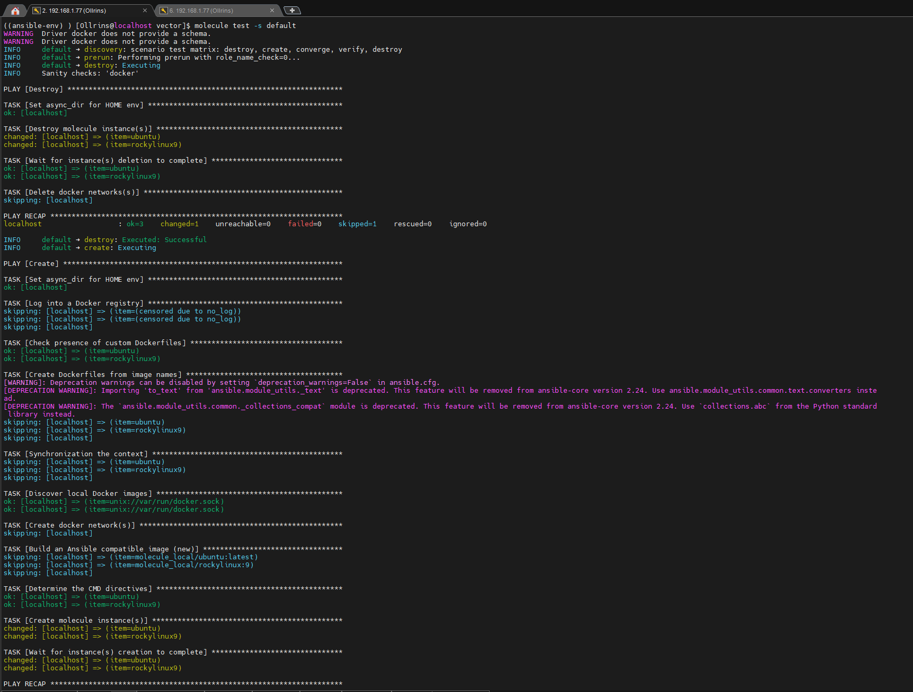
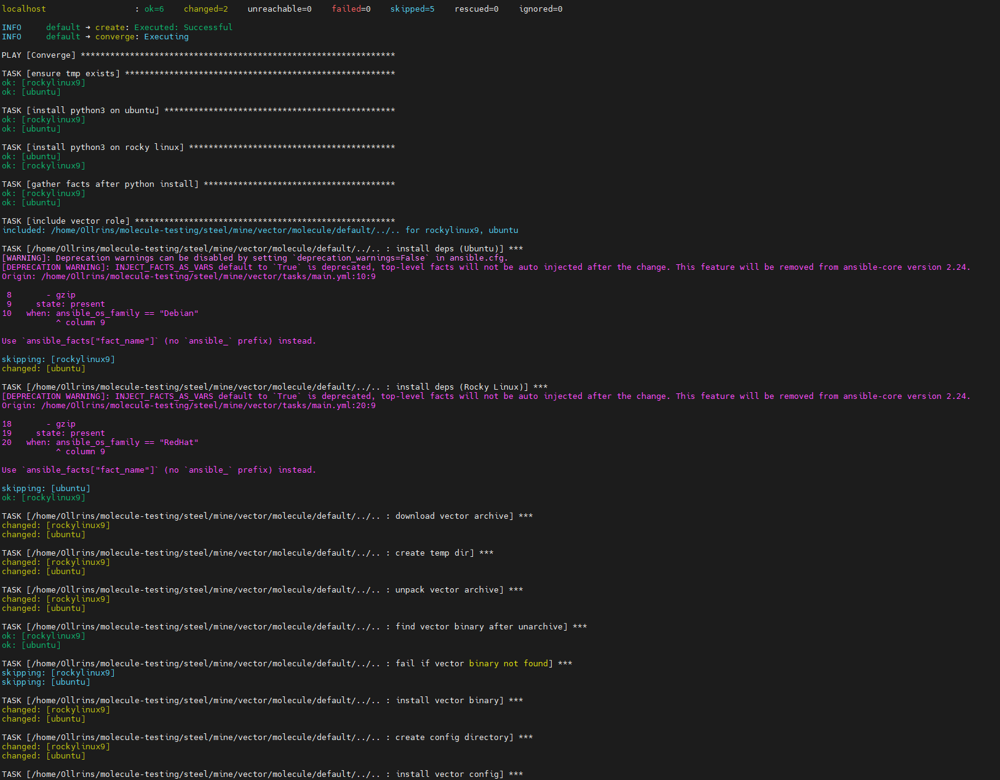
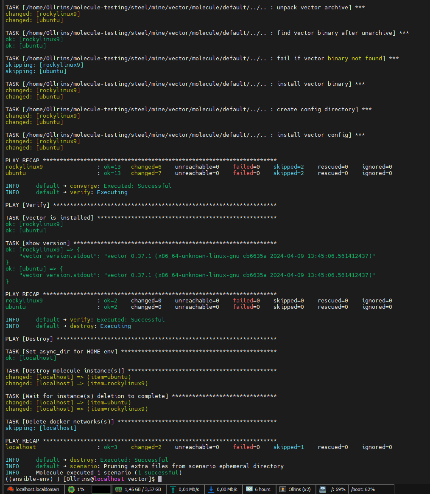
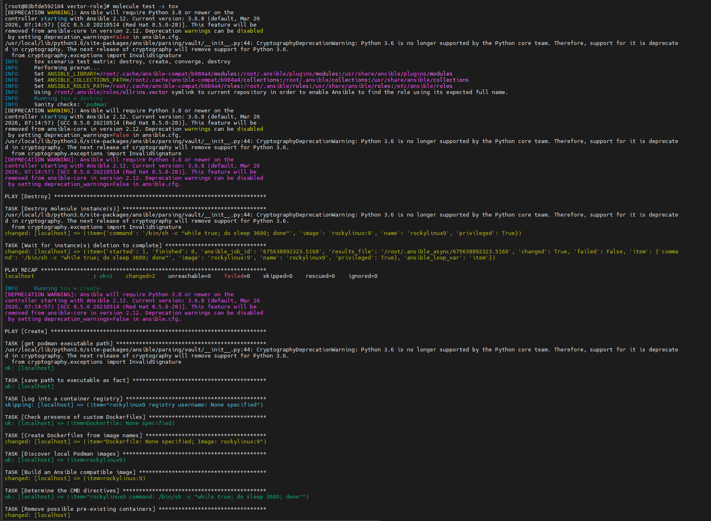
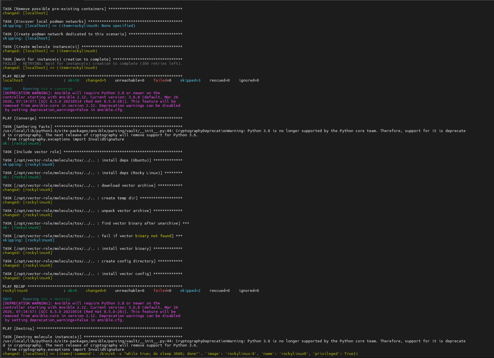

### Домашнее задание к занятию 5 «Тестирование roles»

#### Задание 1

 

  
   
  <em>molecule test -s default</em>

  

  
   

#### Задание 2

 

  
   
  <em>molecule test -s tox</em>

  

  
   

  
   

